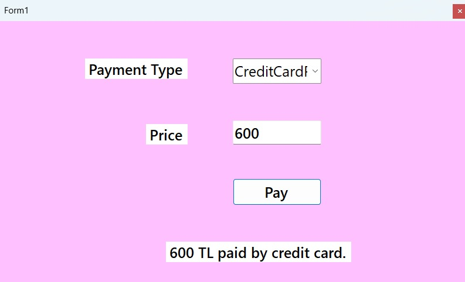

# 💳 Payment Selection System

This is a simple Windows Forms application built with C# and Entity Framework.  
It allows users to select a payment method (e.g., Cash, Credit Card, EFT) and enter an amount to simulate a payment.

## 🧩 Features
- Payment types are fetched dynamically from a SQL Server database
- Reflection is used to create payment classes at runtime
- Clean and user-friendly interface

## 🖼️ Screenshot

 <!-- Replace with your actual image file -->

## 🛠️ Technologies
- .NET 7
- WinForms
- Entity Framework Core
- SQL Server

## ⚙️ How It Works
1. Payment types are read from the `TblPaymentTypes` table.
2. Corresponding classes are created dynamically using reflection.
3. The result of the payment is displayed below the form.

